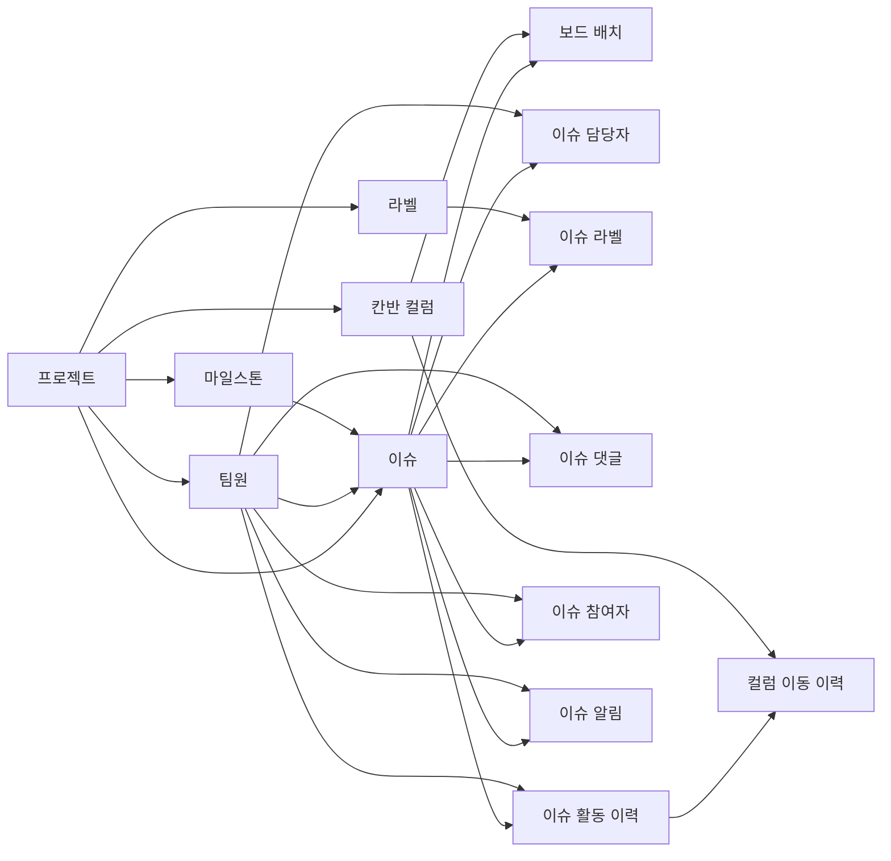

# Kanban-DB

> Team Project 7 GitHub Kanban 보드를 기반으로 설계·구현한 Supabase 데이터베이스입니다.

## 프로젝트 목적

과제 #3에서 사용한 GitHub Kanban 보드의 이슈, 컬럼, 담당자, 마일스톤과 활동 이력을 관계형 데이터베이스로 모델링했습니다. 이슈의 현재 위치와 과거 이동 이력을 분리하여 업무 흐름을 추적할 수 있도록 설계했습니다.

## 기준 서비스

- GitHub Project: [Team-Project7](https://github.com/users/dj-lee-077/projects/2)
- GitHub Repository: [Team-project7](https://github.com/dj-lee-077/Team-project7)
- Supabase Project: `kanban board project`

## 데이터 모델

| 영역 | 주요 테이블 | 역할 |
| --- | --- | --- |
| 기본 정보 | `board_projects`, `board_members` | 프로젝트와 팀원 정보 |
| Kanban 구조 | `board_columns`, `board_project_items` | 컬럼 정의와 이슈의 현재 배치·순서 |
| 업무 정보 | `board_issues`, `board_milestones` | 이슈 원본과 일정 |
| N:M 연결 | `board_issue_assignees`, `board_issue_labels` | 담당자·라벨 연결 |
| 이력 | `board_issue_comments`, `board_issue_activity_events` | 댓글과 이슈 활동 기록 |
| 이동 추적 | `board_column_movements` | 이전 컬럼 → 다음 컬럼, 이동자, 이동 시각 |
| 참여·알림 | `board_issue_participants`, `board_issue_notifications` | 역할별 참여자와 이슈 구독 상태 |

## 핵심 관계도

이슈를 중심으로 현재 보드 배치, 담당자·라벨 연결, 댓글·활동 이력, 참여자·알림 정보가 확장되는 구조입니다.

## 핵심 설계

- `board_issues`는 이슈 제목·상태·작성자 같은 원본 업무 정보를 관리합니다.
- `board_project_items`는 이슈가 보드의 어느 컬럼에 있으며 몇 번째인지 관리합니다.
- `board_column_movements`는 현재 위치가 아니라 이동 이력을 저장하므로 업무 진행 과정을 복원할 수 있습니다.
- 담당자·라벨·참여자는 이슈와 다대다 관계이므로 연결 테이블로 분리했습니다.

## 실제 적재 데이터

- 프로젝트 1개, 팀원 3명, Kanban 컬럼 5개
- 이슈 12개, 보드 아이템 12개, 마일스톤 1개
- 댓글 8건, 이슈 활동 이력 73건, 컬럼 이동 이력 42건
- 참여자 연결 52건, 이슈별 구독 상태 12건

활동 이력에는 프로젝트 추가, 컬럼 상태 변경, 담당자 지정, 이슈 종료, 마일스톤 지정 이벤트가 포함됩니다.

## 보안

모든 테이블에 Row Level Security(RLS)를 활성화했습니다. 현재는 공개 조회 정책을 두지 않아 데이터가 기본적으로 비공개이며, 이후 서비스 화면을 연결할 때 인증 사용자 기준의 정책을 추가할 수 있습니다.

## 참고 자료

- [발표용 개념 ERD (FigJam)](https://www.figma.com/board/6nX8Ol361aLiRCScURTC4d)
- [Supabase Dashboard](https://supabase.com/dashboard/project/mfzqaazlpngwgkrxytkr)

## 알림 데이터 범위

`board_issue_notifications`는 GitHub 전체 알림함이 아니라, 확인 시점의 이슈별 구독 상태 스냅샷입니다. 실시간 알림은 추후 GitHub Webhook과 Supabase Realtime을 연결해 확장할 수 있습니다.
